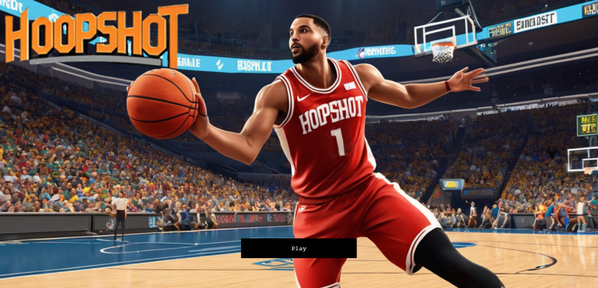

# HoopShot

HoopShot ist ein Basketballspiel, bei dem man es sich zur Aufgabe macht, den eigenen Rekord zu übertreffen.
Wenn man den Korb trifft, wird dem Spieler ein Punkt zugeschrieben. Das Spiel wird durch Bewegen des Mauszeigers in die Schussposition und anschließendes Betätigen der Leertaste ausgeführt. Es ist so konzipiert, dass der Schwierigkeitsgrad mit der Zeit ansteigt, indem sich der Baskteballkorb mit zunehmender Geschwindigkeit nach links und rechts bewegt, um die Spieler herauszufordern. Wenn der Spieler drei Fehlschüsse hintereinander hat, endet das Spiel, und er muss von vorne beginnen.

